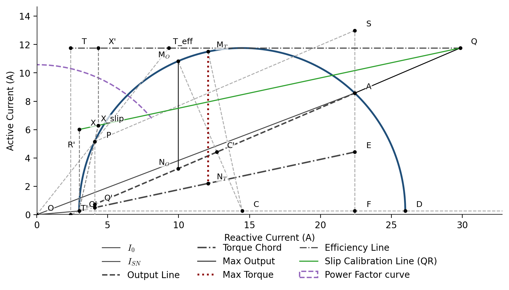

<h1>
  
  HeylandCircle
</h1>

[](https://github.com/abruanspace/HeylandCircle/actions)
[](https://mybinder.org/v2/gh/abruanspace/HeylandCircle/main)
[](https://opensource.org/licenses/MIT)
[](https://www.repostatus.org/#active)


[](https://www.python.org/)
[](https://github.com/abruanspace/HeylandCircle/releases)
[](https://heylandcircle.readthedocs.io/en/latest)

[](https://arxiv.org/abs/2512.20015)
[](https://arxiv.org/abs/2512.08302)
<br></br>

HeylandCircle is a lightweight, modular Python tool for constructing and analyzing the circle diagram of three-phase induction machines, enabling rapid visualization of performance characteristics such as power factor, torque, current, and efficiency.
<br></br>



## Features

- Construct the Heyland circle from machine parameters or test data
- Extract equivalent-circuit parameters from no-load, blocked-rotor, and DC tests
- Locate important operating points, including no-load, full-load, and maximum-torque conditions
- Evaluate induction-machine performance characteristics
- Generate publication-ready circle-diagram visualizations
- Use tested examples through Python scripts or Binder

## Quick Start

HeylandCircle requires Python 3.10 or later. Clone the repository and create a virtual environment:

```bash
git clone https://github.com/abruanspace/HeylandCircle.git
cd HeylandCircle
python3 -m venv .venv
```

Activate the environment:

**macOS / Linux**
```bash
source .venv/bin/activate
```

**Windows (PowerShell)**
```powershell
.venv\Scripts\Activate.ps1
```

Install HeylandCircle in editable mode:

```bash
python -m pip install --upgrade pip
python -m pip install -e .
```

Verify the installation:

```bash
pytest
python examples/motor_circle_diagram.py
```

## Documentation

Complete installation instructions, API documentation, theory, and examples are available in the HeylandCircle documentation.

For release history, see [RELEASENOTES.md](https://github.com/abruanspace/HeylandCircle/blob/main/RELEASE_NOTES.md).

## Citation

If you use HeylandCircle in academic work, please cite:

> Gupta, A., and Gupta, A., "HeylandCircle: A Computational Framework for the Geometric Reconstruction of the Heyland Circle Diagram," arXiv:2512.20015, 2025.

```bibtex
@article{gupta2025heylandcircle,
      title={HeylandCircle: A Computational Framework for the Geometric Reconstruction of the Heyland Circle Diagram}, 
      author={Anubhav Gupta and Abhinav Gupta},
      year={2025},
      eprint={2512.20015},
      archivePrefix={arXiv},
      primaryClass={eess.SY},
      url={https://arxiv.org/abs/2512.20015},
}
```
Citation metadata is also provided in [CITATION.cff](https://github.com/abruanspace/HeylandCircle/blob/main/CITATION.cff).

## References

1. Heyland, A.; "**[A Graphical Treatment of the Induction Motor](https://archive.org/details/graphicaltreatme00heylrich/page/n3/mode/2up)**," New York, NY: McGraw Publishing Company, 1906
1. Langsdorf, A.; "**[Theory of Alternating Current Machines](https://books.google.com/books?id=zKVd780XHGcC&newbks=0&hl=en&source=newbks_fb)**," New York, NY: McGraw-Hill Book Company, 1937
1. Thereja, B. L.; and Thereja, A.K.; "**[A Textbook of Electrical Technology](https://search.worldcat.org/title/78683746)**," New Delhi, India: S. Chand Publishing, 2014
1. Fritzgerald, A.; Kingsley Jr., C.; and Umans, S.; "**[Electric Machinery](https://search.worldcat.org/title/49726399)**," 6th ed., New York, NY: McGraw-Hill, 2002
1. D. Kothari and I. Nagrath, "**[Electric Machines.](https://search.worldcat.org/title/56399794)**". McGraw-Hill, 4th ed., 2011.
1. P. C. Krause, O. Wasynczuk, S. Sudhoff, and S. Pekarek, "**[Analysis of Electric Machinery and Drive Systems.](https://search.worldcat.org/title/1164444813)**". Wiley-IEEE Press, 3rd ed., 2013.
1. Carpaneto, E.; and Savio, S.; “**A Teaching Tool for the Heyland Circle Diagram using Numerical Simulation**,” IEEE Transactions on Education, vol. 45, no. 3, pp. 263–270, 2002.
1. Gupta, A.; and Gupta, A.; "**[Testing of Transformers and Induction Machines.](https://search.worldcat.org/title/818848055)**" 1st ed., Charleston, SC: CreateSpace, 2012
1. Gupta, A.; "**[Möbius Transformations and the Analytic-Geometric Reconstruction of the Induction-Machine Circle Diagram.](https://arxiv.org/abs/2512.08302)**" In arXiv:2512.08302, 2025 [math.DS]
1. Gupta, A.; and Gupta, A.; "**[HeylandCircle: A Computational Framework for the Geometric Reconstruction of the Heyland Circle Diagram.](https://arxiv.org/abs/2512.20015)**" In arXiv:2512.20015, 2025 [eess.SY]
1. Jurkovic, S.; "**[Induction Motor Parameters Extraction.](https://web.mit.edu/kirtley/binlustuff/literature/electric%20machine/motor-parameters.pdf)**", Educypedia-Electronics, 2014